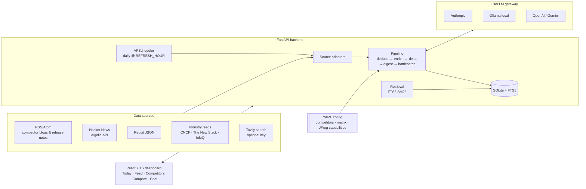
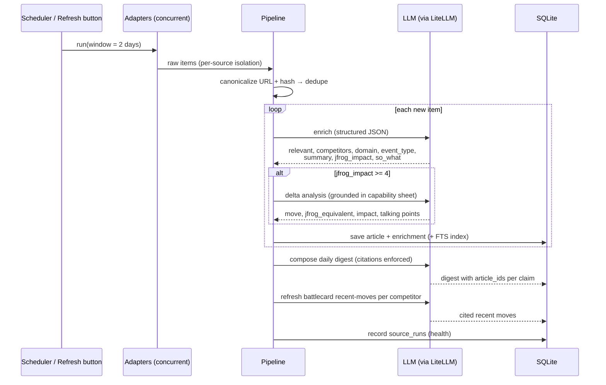
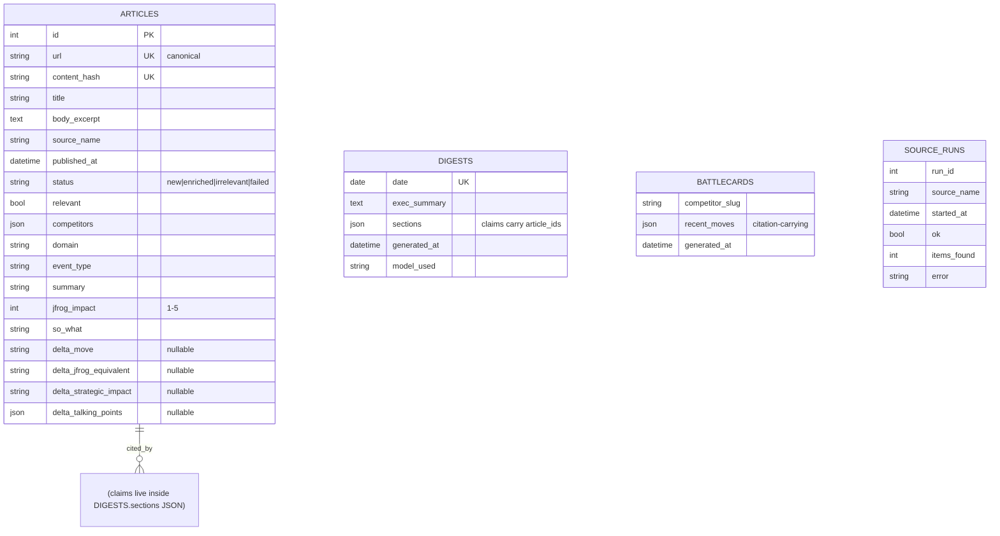
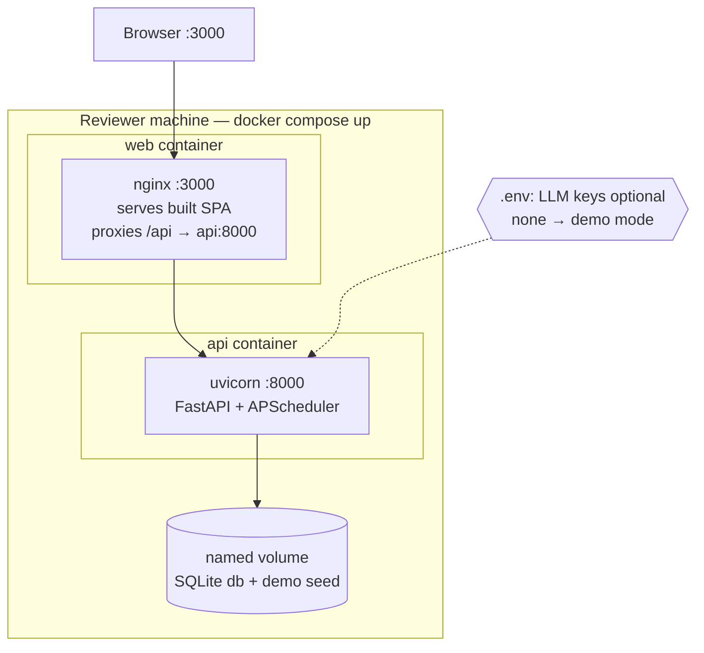

# ARCHITECTURE.md — Ribbit

Living document: diagrams are kept in sync with the implementation. Rendered natively by GitHub (Mermaid).

## 1. System context

## 2. Daily pipeline sequence

## 3. Data model

Note: competitors, the feature matrix, and the JFrog capability sheet are **YAML config**, not database tables (ADR-009).

## 4. Deployment

## 5. Key flows to remember

- **Demo mode**: no usable LLM at startup → seed `data/demo/seed.json` → banner in UI; Refresh disabled.
- **Citation enforcement**: digest/battlecard JSON is schema-validated; claims without existing `article_ids` are dropped before save.
- **Provider swap**: `LLM_PROVIDER`/`LLM_MODEL` env vars only — no code change (ADR-004).
