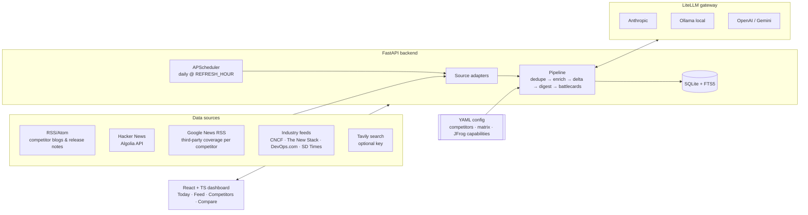
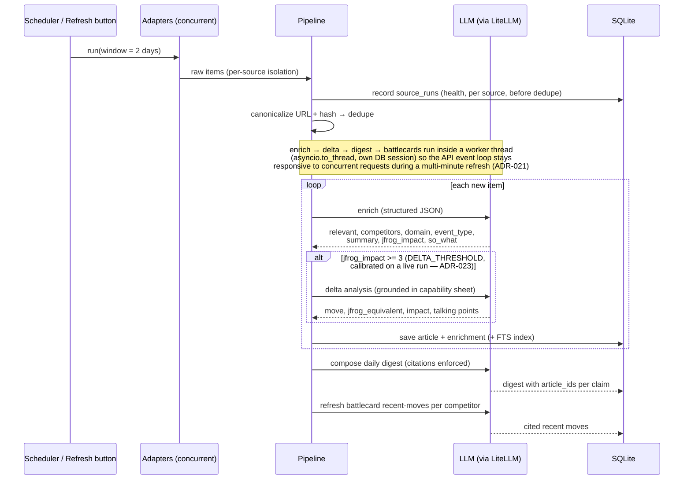
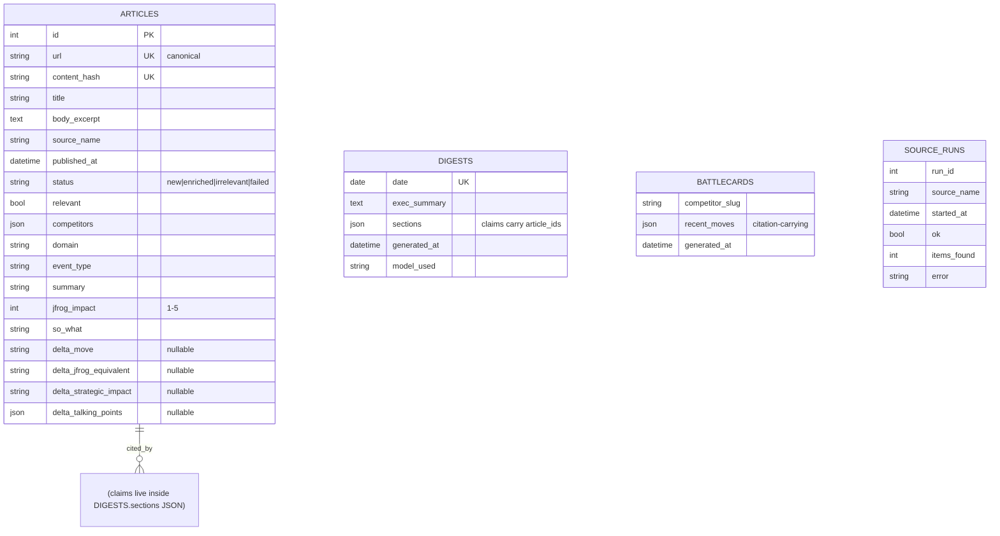
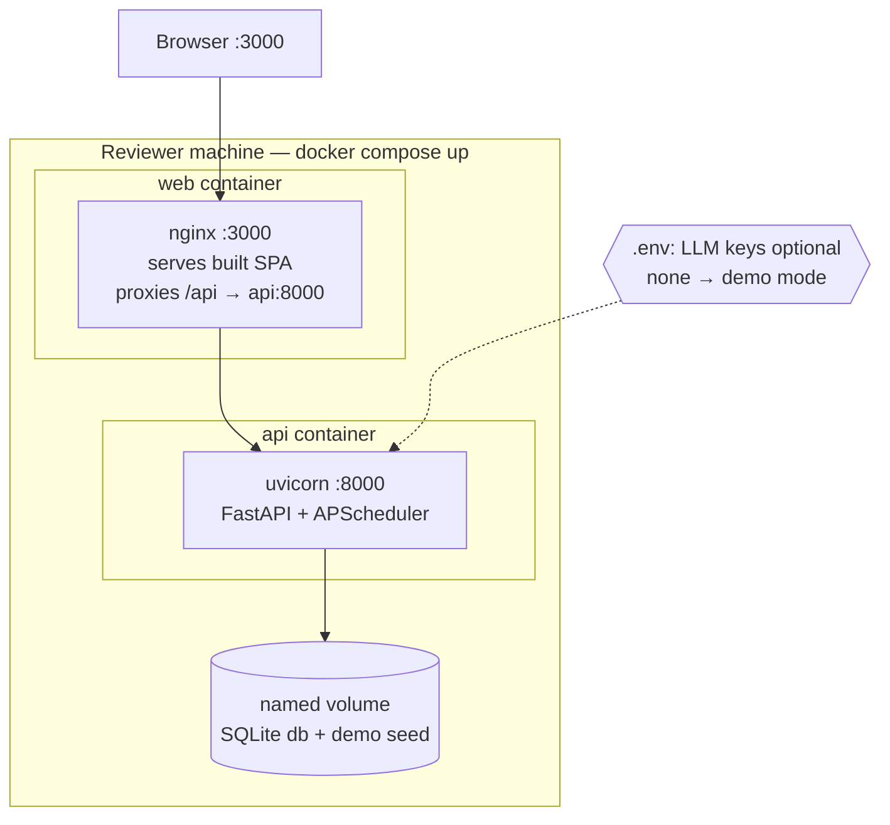

# ARCHITECTURE.md — Ribbit

Living document: diagrams are kept in sync with the implementation. Rendered natively by GitHub (Mermaid).

## 1. System context

Notes:
- The FTS5 table already backs the Feed tab's search box today. An analyst-chat tab with its
  own BM25-ranked retrieval module was designed (ADR-006) but not built in this pass — see the
  roadmap in README.md.
- Reddit was removed as a source after a live run showed it returns 403 to unauthenticated
  clients; Google News RSS replaced it and restored third-party coverage (ADR-024, ADR-026).
  The Reddit adapter and its tests remain in the codebase, disabled by config.
- 20 sources total, all keyless: per competitor a vendor blog feed + a Hacker News query + a
  Google News query, plus the four industry feeds. Tavily is optional and only used if a key
  is present.

## 2. Daily pipeline sequence

## 3. Data model

Note: competitors, the feature matrix, and the JFrog capability sheet are **YAML config**, not database tables (ADR-009).

## 4. Deployment

## 5. Key flows to remember

- **Demo mode**: no usable LLM at startup → seed `data/demo/seed.json` → banner in UI; Refresh disabled.
- **Citation enforcement**: digest/battlecard JSON is schema-validated; claims without existing `article_ids` are dropped before save.
- **Provider swap**: `LLM_PROVIDER`/`LLM_MODEL` env vars only — no code change (ADR-004).
- **LLM stages off the event loop**: the four LLM-touching stages run via `asyncio.to_thread`
  on their own DB session, separate from the fetch/insert session (ADR-021); the pipeline
  also refuses to start a second run while one is already in progress (ADR-022).
- **No vector database anywhere**: retrieval is SQLite FTS5 — already powering the Feed
  tab's search box. A dedicated BM25-ranked retrieval module for an analyst-chat tab was
  designed (ADR-006) but is not built; it is a roadmap item, not a shipped diagram box.
