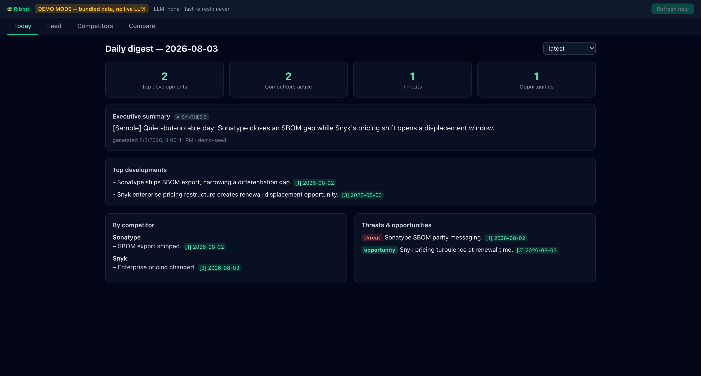
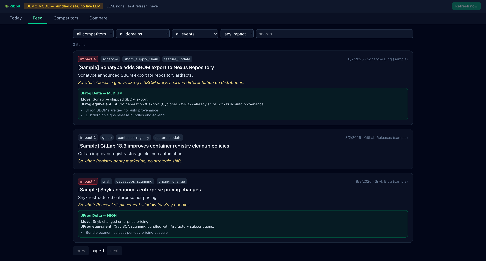
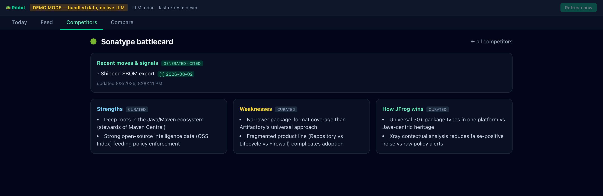
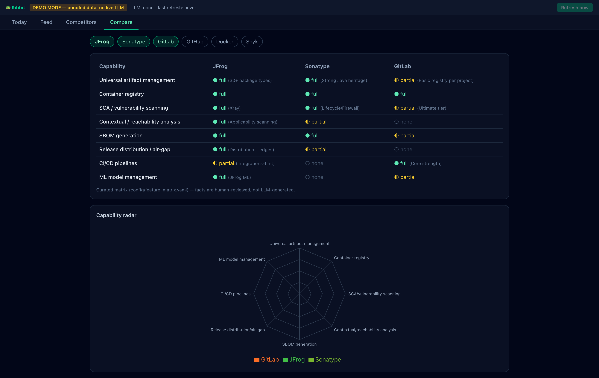

# 🐸 Ribbit — Competitive Intelligence for JFrog

Ribbit keeps a competitive-intelligence analyst on top of a daily-shifting landscape: it
ingests domain-curated news about five JFrog competitors — Sonatype, GitLab, GitHub,
Docker, and Snyk — every day, uses an LLM to filter out noise and structure each item
(domain, event type, a 1-5 JFrog-impact score, a one-line "so what"), and publishes a
cited daily digest, per-competitor battlecards, and a JFrog-vs-competitor comparison, all
in one dashboard. Built as a home-assignment deliverable for JFrog's Competitive
Intelligence (CI) team.

## Quick start (zero keys needed)

    docker compose up --build

Open **http://localhost:3000**. With no API keys configured, Ribbit auto-detects that no
LLM provider is reachable and boots in **demo mode**, loading a small bundled sample
dataset — 3 hand-written articles covering Sonatype, GitLab, and Snyk — so every tab is
populated immediately. It's illustrative sample data, not a capture from a real pipeline
run (see [Live mode](#live-mode-real-daily-intelligence) below for that).

A clean build (no Docker layer cache) took about 30 seconds on the machine this was
verified on, mostly downloading Python and npm packages — expect it to vary with your
network. Rebuilds after the first one reuse cached layers and finish in seconds.

## Live mode (real daily intelligence)

> **You need your own API key to see live data.** The screenshots and demo-mode dashboard
> in this README run on the small bundled sample dataset above, which exists only so the
> keyless demo isn't an empty screen — it is static and does not reflect real news. To
> fetch and analyze real competitor news, supply your own key below.

    cp .env.example .env    # add ANTHROPIC_API_KEY (or switch LLM_PROVIDER; see below)
    docker compose up --build

- Once a real provider is configured, the **Refresh now** button (disabled in demo mode)
  fetches and analyzes fresh news on demand; a scheduled run also fires daily at
  `REFRESH_HOUR` (default `07`, local server time).
- Provider-agnostic by design via LiteLLM: `LLM_PROVIDER=anthropic|openai|gemini|ollama`
  (`LLM_MODEL` picks the model). A local Ollama keeps sensitive competitive data fully
  in-house — see `.env.example` for every variable.
- Optional: `TAVILY_API_KEY` adds one more news-search query per competitor.

## Screenshots

Captured against the keyless demo above — hence the `[Sample]` prefixes; live mode shows
the same views populated with real, unprefixed news.

| | |
|---|---|
|  |  |
| **Feed** — filterable and full-text searchable (SQLite FTS5), with a **Delta** panel tying a competitor move to the closest JFrog equivalent. | **Battlecard** — generated, cited "recent moves" sit visually apart from human-curated strengths/weaknesses. |

**Compare** — an 8-capability × 6-vendor matrix (`config/feature_matrix.yaml`) plus a
radar chart. The matrix is config, not generation — nothing on this tab comes from an LLM.

## How it works

Fetch (RSS/Atom, Hacker News, Reddit, optional Tavily — 20 source feeds/queries by
default across the 5 competitors plus 4 industry-wide feeds, up to 25 with Tavily
enabled; per-source isolation so one dead feed doesn't stop the run) → dedupe (canonical
URL **or** content hash, since the same story genuinely arrives by several routes) → LLM
enrichment (strict relevance gate, domain × event-type taxonomy, impact 1-5, a one-line
"so what") → Delta analysis for high-impact (≥4) items, grounded in a curated JFrog
capability sheet → cited daily digest → cited battlecard refresh. The four LLM-touching
stages run in a background worker thread (`asyncio.to_thread`) so the API stays
responsive during a multi-minute refresh, and the pipeline refuses to start a second run
while one is in progress. Full diagrams — system context, this sequence, the data model,
and deployment: [ARCHITECTURE.md](ARCHITECTURE.md).

**Anti-hallucination is structural, not aspirational.** Every generated claim carries
`article_ids` that must resolve to ingested articles — the schema layer strips unknown
ids and drops any claim left with none (the "hallucination firewall," enforced in code,
not just prompted for). Delta analysis may only reference JFrog capabilities from a
human-curated YAML sheet. The comparison matrix is config, not generation. And the one
part of the digest that *isn't* citable — the executive summary — is prompt-constrained
to synthesize only what's already cited elsewhere, and is labeled **AI SYNTHESIS** in the
UI rather than presented as an equally-trustworthy claim. Decision log with the reasoning
behind every choice: [DECISIONS.md](DECISIONS.md) (22 ADRs).

## Built now vs. future roadmap

**Demonstrated now:** a daily-scheduled pipeline (plus a manual refresh) that refuses to
run twice concurrently; 5 competitors across 20 source feeds/queries by default (25 with
Tavily); GenAI enrichment with a strict relevance gate and a domain × event-type
taxonomy; Delta analysis grounded in a curated capability sheet; a cited daily digest and
battlecards behind a schema-enforced citation firewall; an 8-capability × 6-vendor
comparison matrix and radar chart; full-text search over the corpus (SQLite FTS5); a
keyless demo mode that guarantees a populated UI; 72 backend tests, 2 frontend
component tests, a clean `ruff check` and `tsc --noEmit`, all run in CI alongside a
Docker build; one-command deploy with zero required API keys.

**With more time/resources:** an analyst-chat tab — a BM25-ranked retrieval module over
the same SQLite FTS5 index that already powers Feed search's full-text filter was
deliberately chosen over standing up a vector database, but the chat endpoint and UI
themselves aren't wired up yet; Postgres +
pgvector for semantic retrieval once the corpus outgrows "hundreds-to-thousands of short
articles" (a connection-string change, thanks to SQLAlchemy); a queue/orchestrator (e.g.
Airflow) once fetch fan-out outgrows a single in-process scheduler; Slack/email digest
delivery; authentication/multi-tenancy; a human-in-the-loop curation UI for the YAML
config; historical backfill beyond the seed window; an LLM-output eval harness (golden
set, precision tracking); pricing-page and docs diff-watchers; win/loss and review-site
ingestion; mobile layout polish; autonomous deep-research agents (deliberately scoped out
of v1 as too slow, expensive, and flaky for a live demo).

## Challenges & pitfalls we hit

The full, dated log is in [INSIGHTS.md](INSIGHTS.md); a few that stood out:

- **The scariest failures were silent, not loud.** Reddit posts missing a `permalink`
  all collapsed onto the same dedupe key, and whitespace-only URLs all canonicalized to
  the same sentinel — in both cases the pipeline reported success while quietly
  discarding real stories. Nothing crashed and nothing logged; the only symptom was a
  thinner digest.
- **SQLite drops timezones, and the damage doesn't stay contained.** Datetimes written as
  aware UTC read back naive from a fresh session; because the API serializes with
  `.isoformat()`, the browser parsed the offset-less string as *local* time, shifting
  every timestamp and pushing near-midnight items onto the wrong day. Fixed once with a
  `UtcDateTime` type decorator instead of at a dozen call sites.
- **A green test suite can still be lying.** Two config-loader guard tests only proved
  themselves once they were pointed at deliberately broken YAML (a renamed key, a
  dropped vendor) and watched to see them actually fail.
- **"Fails loudly" has to be checked, not assumed.** Source adapters raised on HTTP
  errors as designed, but a feed returning `200 OK` with truncated XML parsed to zero
  entries and returned quietly — which a naive health check would show as a healthy
  source simply having a slow news day.
- **The riskiest gap in a citation-enforcement story was the field with no citations.**
  The digest's executive summary is bare prose with no `article_ids`, so no validator
  could catch a fabricated claim inside it. It's now prompt-constrained and visibly
  labeled `AI SYNTHESIS` rather than presented as equally trustworthy to the cited
  sections around it.
- **Cutting the vector database was a judgment call, not a default.** The first draft
  included Chroma for RAG chat; challenged on whether it was necessary, the honest answer
  was no — at this corpus size FTS5/BM25 retrieval is competitive with embeddings and
  adds zero dependencies. Its plain FTS5 index is already what powers Feed's search box
  today; the BM25-ranked retrieval a chat feature would need is designed, not yet built.

## Development

    cd backend && python3.12 -m venv .venv && source .venv/bin/activate
    pip install -r requirements-dev.txt && pytest -q       # 72 backend tests
    uvicorn app.main:create_app --factory --reload         # api on :8000
    cd frontend && npm install && npm run dev              # ui on :5173+ (proxies /api; Vite prints the exact URL)

CI (`.github/workflows/ci.yml`) runs `ruff check`, `pytest`, `tsc --noEmit`, `vitest`,
and a `docker compose build` on every push.
